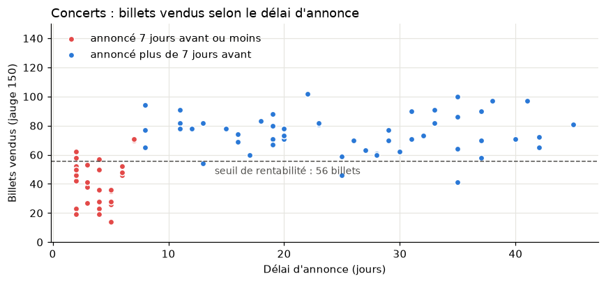

# Le Lien : refonte de site et analyse de la programmation d'une association culturelle

Projet d'équipe réalisé en 5 jours pendant le **bootcamp IA de DesCodeuses** (Paris, septembre 2026), que j'ai coordonné, puis repris et corrigé seule pour la partie analyse de données.

Le Lien est une association culturelle fictive installée dans une ancienne halle : concerts, ateliers, expositions, un public de 20 à 70 ans. Le projet comportait deux volets :

1. **Refonte du site web** : identité visuelle, parcours utilisateurs par tranche d'âge, architecture du site ([présentation](docs/presentation_refonte_site_le_lien.pdf)).
2. **Analyse de la programmation** : 168 événements de septembre 2025 à juin 2026, pour comprendre ce qui remplit la salle et ce qui couvre les coûts.

Ce dépôt met l'accent sur le second volet.

## Résultats principaux



- **Le délai d'annonce est le facteur le plus net.** Pour les trois types d'événements, plus l'annonce est faite tôt, meilleur est le remplissage (corrélation de Spearman entre 0,53 et 0,64, p < 0,001). La rupture se situe autour de 7 jours.
- **Les concerts perdent de l'argent quand ils sont annoncés tard.** 25 des 30 concerts annoncés 7 jours ou moins à l'avance sont sous le seuil de rentabilité (56 billets). Pour ceux annoncés plus tôt, c'est 3 sur 51.
- **Les ateliers sont presque toujours pleins** (82 % de remplissage) mais leur marge est faible, avec une piste d'ajustement du prix ou de doublement des sessions.
- **Les expositions sont gratuites** : leur coût (13 760 € sur la saison) n'est couvert par aucune recette de billetterie, ce qui renvoie à des financements absents des données.

| Type | Événements | Remplissage moyen | Marge totale |
|---|---|---|---|
| Atelier (30 places, 8 €) | 43 | 82 % | +700 € |
| Concert (150 places, 14 €) | 81 | 42 % | +7 772 € |
| Exposition (80 places, gratuit) | 43 | 50 % | -13 760 € |

*Hors un concert exceptionnel de 400 places, voir « Contrôle qualité » ci-dessous.*

**Recommandation principale** : annoncer chaque concert au moins 8 jours à l'avance et faire un point billetterie à J-7. Cela rejoint la refonte du site, où la page Programmation et la newsletter sont mises en avant.

Le détail est dans le notebook [`notebooks/analyse_programmation.ipynb`](notebooks/analyse_programmation.ipynb).

## Ce qui a été corrigé par rapport à la version du bootcamp

La première version, faite dans un tableur en fin de bootcamp, est conservée dans [`docs/analyse_version_bootcamp.pdf`](docs/analyse_version_bootcamp.pdf). En la reprenant, j'ai corrigé les points suivants :

| Version bootcamp | Version actuelle |
|---|---|
| Corrélation calculée sur les 3 médianes par type (3 points, donc sans valeur) | Corrélation calculée sur chacun des 167 événements, par type |
| Courbe reliant des catégories (Atelier, Concert, Exposition) | Nuages de points et diagrammes en barres |
| Camembert des coûts sans les expositions (Atelier 33 %, Concert 67 %) | Répartition réelle : Atelier 9 %, Concert 75 %, Exposition 16 % |
| Colonne « Champ calculé 1 » sans explication | Taux de couverture des coûts et marge nommés et définis |
| Concert de 400 places inclus sans vérification | Valeur atypique repérée, signalée et exclue des moyennes |
| Billets vendus comparés entre salles de tailles différentes | Taux de remplissage (billets / jauge) |

## Contrôle qualité des données

Le fichier a été vérifié avant analyse : aucune valeur manquante, jour de la semaine cohérent avec la date, recette égale à billets x prix sur toutes les lignes, aucune vente au-dessus de la jauge.

Une seule anomalie : le 20 mars 2026 compte deux concerts, dont un avec une jauge de 400 places (toutes les autres sont à 150). Cette ligne est gardée dans les données brutes mais exclue des moyennes, car elle ajoute à elle seule 3 920 € de marge aux concerts.

## Limites

- Corrélation ne veut pas dire causalité : les concerts annoncés tôt sont peut-être aussi ceux d'artistes plus connus, et ces informations ne sont pas dans les données.
- Une seule saison, sans point de comparaison d'une année sur l'autre.
- Pas de données sur les subventions, adhésions ou le bar : la marge calculée n'est pas le résultat financier de l'association.
- Données fournies dans le cadre de l'exercice.

## Structure du dépôt

```
.
├── data/raw/evenements_le_lien.csv      données (168 événements, 9 colonnes)
├── notebooks/analyse_programmation.ipynb analyse complète, commentée
├── figures/                              graphiques produits par le notebook
├── docs/
│   ├── presentation_refonte_site_le_lien.pdf
│   └── analyse_version_bootcamp.pdf
└── requirements.txt
```

### Colonnes du jeu de données

| Colonne | Description |
|---|---|
| `date`, `jour` | date de l'événement et jour de la semaine |
| `type_evenement` | Atelier, Concert ou Exposition |
| `jauge` | nombre de places |
| `billets_vendus` | billets vendus (ou entrées pour les expositions gratuites) |
| `prix_billet` | prix unitaire en euros |
| `recette` | billets_vendus x prix_billet |
| `cout_production` | coût de l'événement en euros |
| `delai_annonce_jours` | nombre de jours entre l'annonce et l'événement |

## Reproduire l'analyse

```bash
python -m venv .venv
source .venv/bin/activate
pip install -r requirements.txt
jupyter notebook notebooks/analyse_programmation.ipynb
```

## Outils

Python (pandas, matplotlib, SciPy), Jupyter. Version initiale réalisée dans un tableur (tableaux croisés dynamiques).

## Équipe

Projet réalisé en équipe au bootcamp IA de DesCodeuses par **Soumeya Benhaddouche**, Amelee, Elisabeth et Maria.

J'ai coordonné le projet et réalisé la majeure partie du travail, puis j'ai repris et corrigé seule l'analyse de données après le bootcamp.
